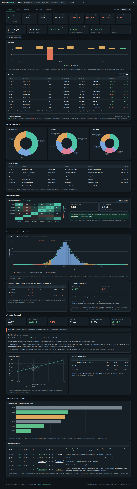
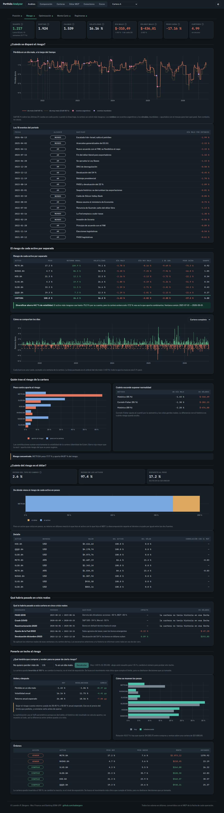
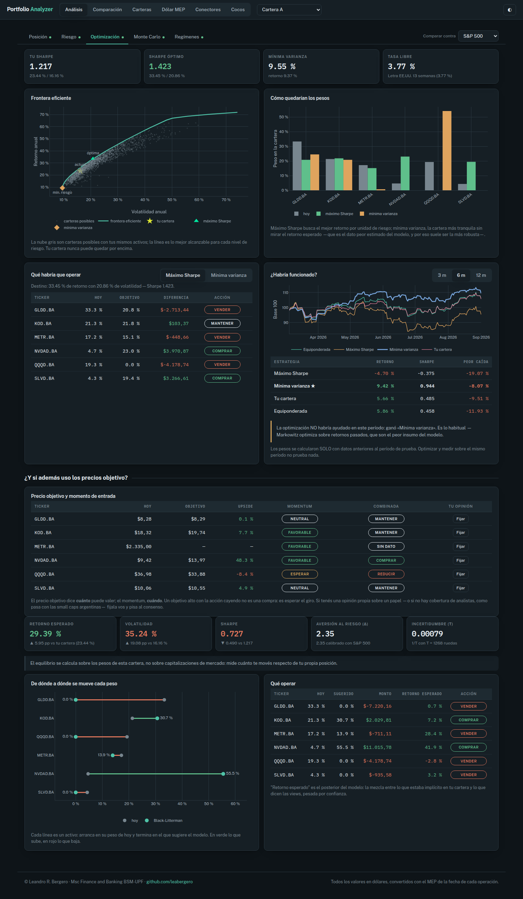
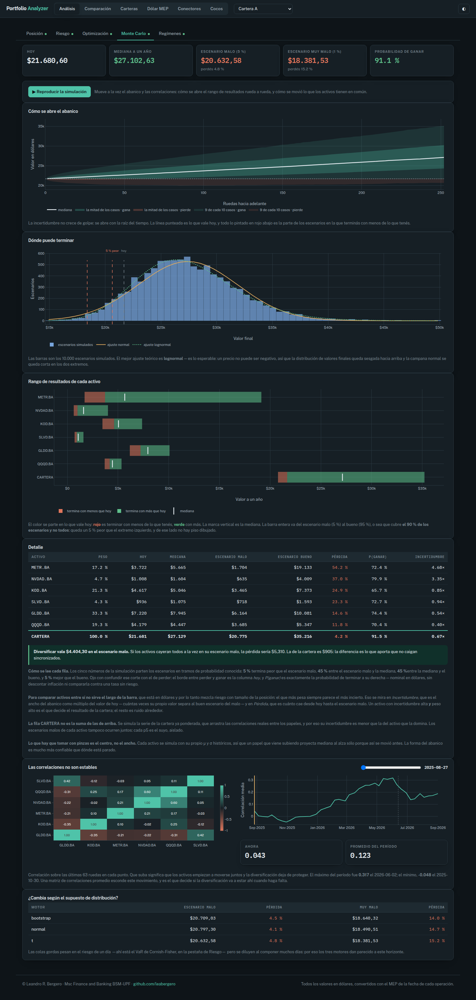
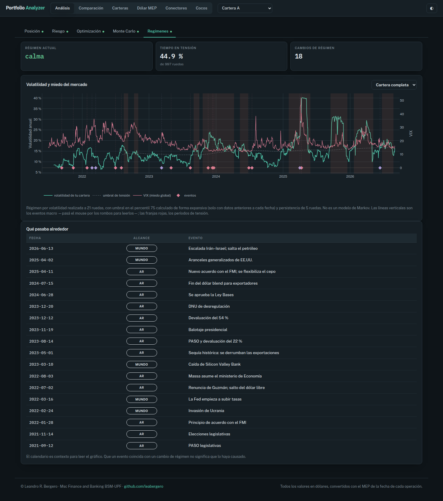
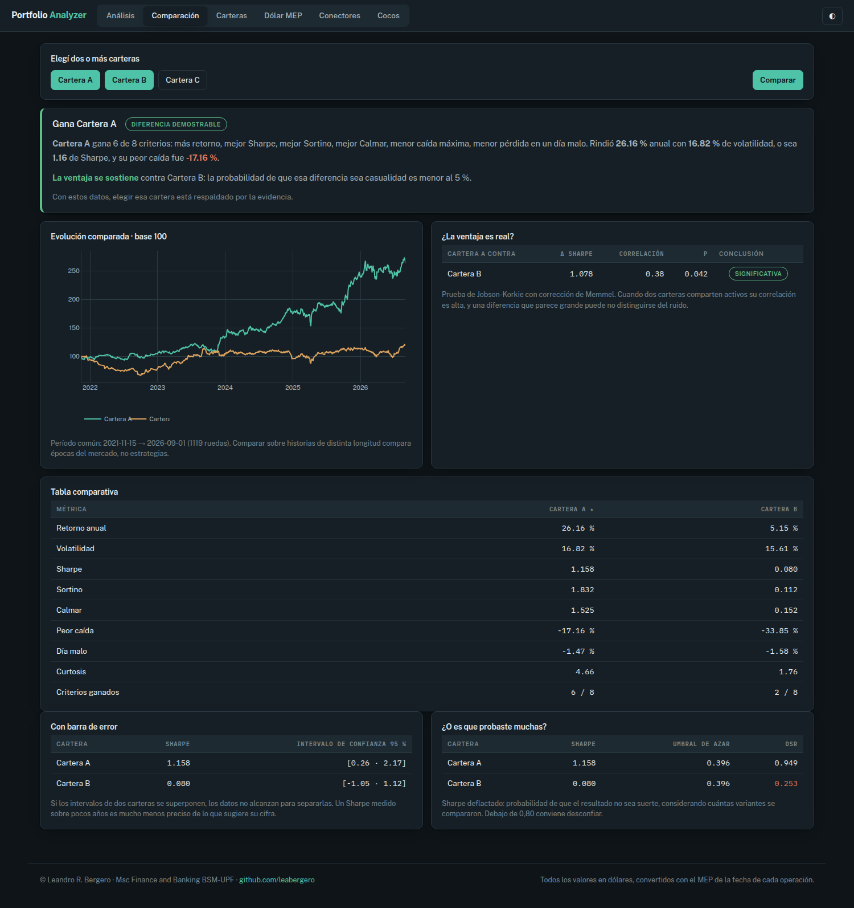
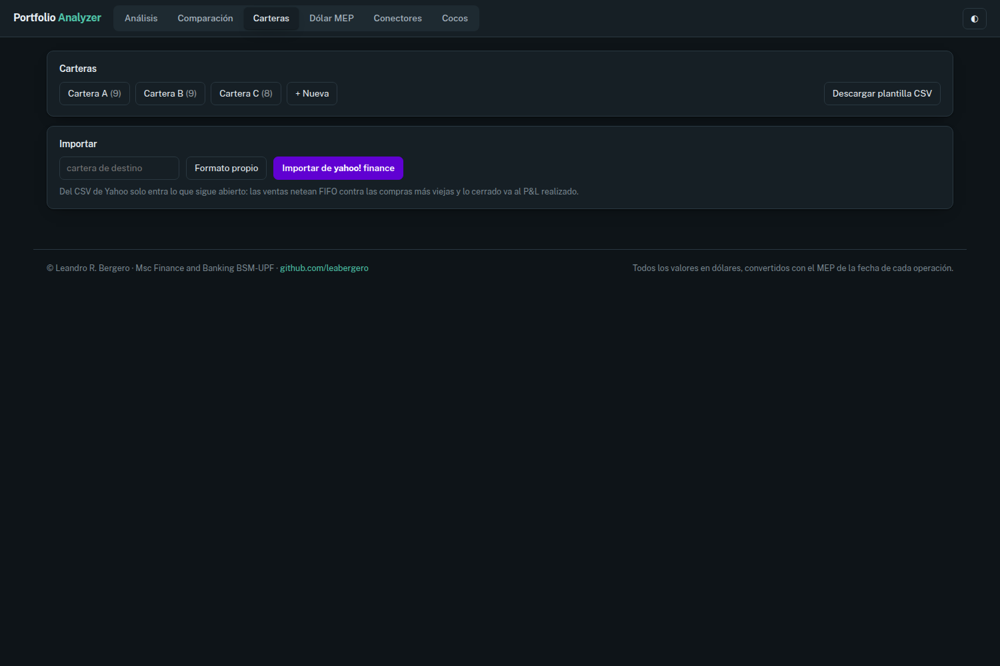
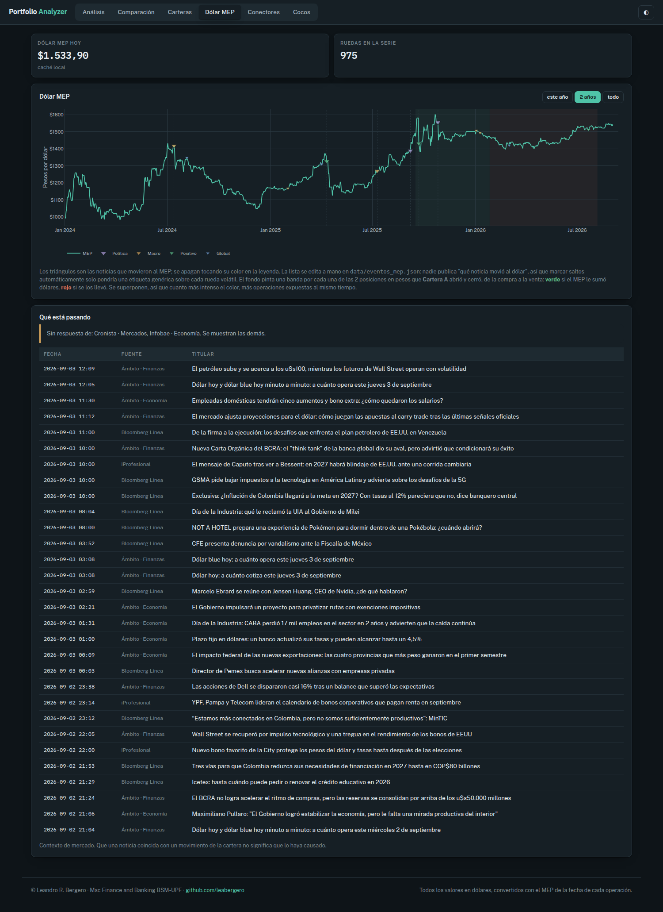
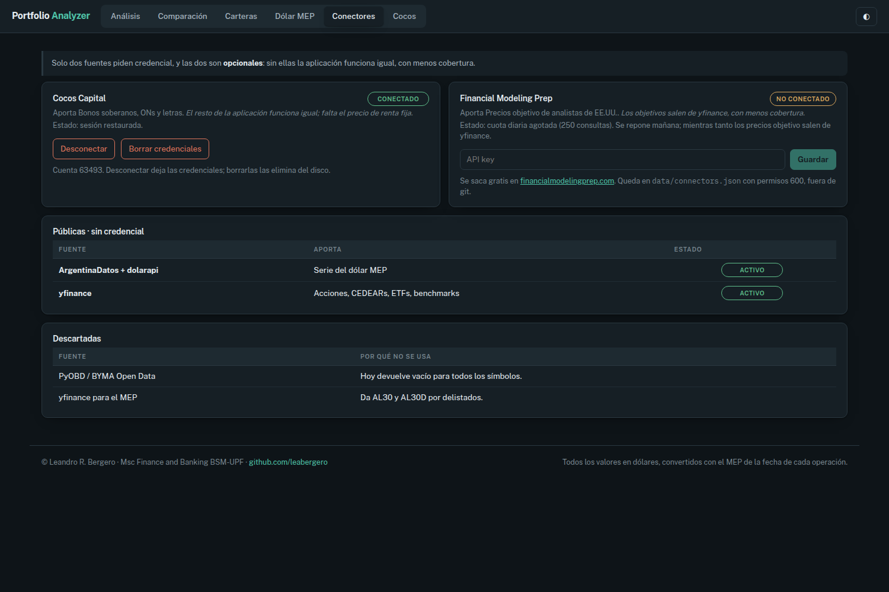
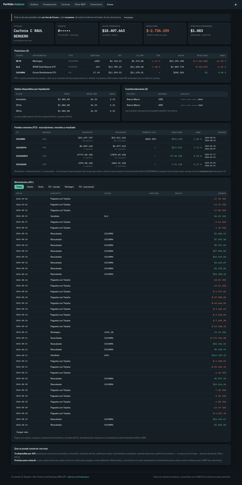

# Portfolio Analyzer

Herramienta de análisis de carteras con foco en el mercado argentino: acciones,
CEDEARs, bonos soberanos y obligaciones negociables. **Todo medido en dólares**,
con el MEP de la fecha exacta de cada operación.

Dos modos de uso: **Análisis** (¿qué tengo y cuánto puedo perder?) y
**Comparación** (¿cuál cartera es mejor, y por qué?). Suma un espejo de solo
lectura de la cuenta real en el broker.

> **Ver la posición de la cartera → entender el riesgo y los modelos que lo
> sustentan → comparar contra benchmarks y entre carteras.**

---

## Análisis

Se elige una cartera y la app lanza todos los modelos en paralelo; cada pestaña
aparece apenas su modelo termina. Se compara contra un benchmark elegible
(S&P 500 · Merval · STOXX 600, todos en USD).

### Posición

Qué tenés, cuánto vale hoy y cuánto ganaste o perdiste, todo en dólares.
Tenencias lote por lote, posiciones cerradas, y el resultado partido en dos: **lo
que dejó el papel** vs. **lo que se llevó el tipo de cambio**. Debajo, la
composición de la cartera y los KPI de riesgo.

**Modelos:** `portfolio` (valuación y P&L con MEP por fecha de operación),
`composicion` (cortes por tipo / sector / industria sobre el valor actual en USD).



### Riesgo

Cuánto podés perder y qué activo trae ese riesgo: VaR, CVaR, volatilidad,
desviación a la baja, y un stress test contra escenarios históricos.

**Modelos:** `risk` (VaR/CVaR histórico y paramétrico, Sortino con la caída
promediada sobre todas las ruedas) y `risk.stress_test`.



### Optimización

La frontera eficiente y las carteras de máximo Sharpe y mínima varianza, contra
dónde está tu cartera hoy. Incluye backtest y las views de Black-Litterman.

**Modelos:** `markowitz` (frontera resuelta con SLSQP, óptimo exacto y
determinista) y `blacklitterman` (parte del equilibrio del mercado y lo corrige
con tus opiniones; sin views, no mueve nada).



### Monte Carlo

El abanico de futuros posibles de la cartera — no una predicción, sino el rango
de lo que puede pasar y con qué frecuencia.

**Modelos:** `montecarlo` (movimiento browniano geométrico, miles de
trayectorias, con la corrección −½σ² del GBM).



### Regímenes

Cuándo el mercado cambió de humor: períodos de volatilidad alta cruzados con un
calendario de eventos macro, para leer una caída junto a lo que pasaba alrededor.

**Modelos:** `regimenes` (umbral de crisis sin sesgo de anticipación: se calcula
sólo con datos hasta cada fecha).



**Modelos de apoyo, transversales:** `capm` (β, α, R², Treynor, Information Ratio
contra el benchmark), `momentum` (12−1, salteando el último mes según
Jegadeesh–Titman), `targets` (precios objetivo de analistas), `bonds` (TIR por
Brent, duración, DV01, convexidad de la renta fija), `rates` (tasa libre de
riesgo de corto plazo, letra a 13 semanas).

---

## Comparación

Una cartera contra un benchmark, o dos carteras entre sí, con el ganador
justificado por criterios explícitos (retorno, riesgo, Sharpe), todo en USD. No
sólo dice cuál ganó: **prueba si la diferencia es real o puede ser azar**.

**Modelos:** `comparacion` — test de Jobson-Korkie con corrección de Memmel para
la diferencia de Sharpe, intervalos de confianza del Sharpe, y Sharpe deflactado
(DSR) para descontar el sesgo de haber probado muchas carteras.



---

## Carteras

Alta y edición de carteras. Importa desde CSV propio o desde el export de Yahoo
Finance (las ventas netean FIFO contra las compras más viejas), y descarga una
plantilla.

**Modelos:** `io/csv_native`, `portfolio`.



---

## Dólar MEP

La serie del dólar MEP con hitos históricos (crisis, política, macro) marcados
sobre la curva, y las noticias. Con una cartera elegida, dibuja sobre la curva el
tramo de dólar que recorrió cada operación cerrada en pesos.

**Modelos:** `data/mep` (serie desde ArgentinaDatos + dolarapi),
`data/noticias`.



---

## Conectores

El estado de las fuentes de datos. Dos piden credencial y las dos son
opcionales: **Cocos Capital** (bonos, ONs, letras) y **Financial Modeling Prep**
(precios objetivo). Las públicas (dólar MEP, yfinance) van sin credencial.

**Modelos:** `broker/vault` (credenciales cifradas AES-256-GCM en `data/vault/`,
fuera de git), `data/connectors`, `data/fmp`.



---

## Cocos

Espejo de la cuenta real del broker, en vivo y en pesos, de **solo lectura**:
perfil, posiciones con precio promedio y variación del día, saldos por plazo de
liquidación, seguimiento por FCI (suscripciones, rescates y resultado, detectados
por ticker), movimientos clasificados con filtro, y cuentas bancarias.

**Modelos:** `broker/cocos` sobre pyCocos, con un parche propio
(`broker/_cocos_patch`) que repara el login nuevo de Cocos.

*(Captura con los datos identificatorios enmascarados.)*



---

## Arranque

```bash
python3 -m venv .venv && .venv/bin/pip install -r requirements.txt
npm install && npm run build      # precompila el JSX a web/app.js
.venv/bin/python -m api.app       # http://127.0.0.1:5002
```

`tests/test_verdades.py` corre sin instalar nada: cada caso es un bug real que ya
se pagó una vez en las apps anteriores.

## Estructura

```
core/           el motor — no sabe que existe la web
  data/         fuentes, caché, MEP, conectores
  broker/       Cocos Capital + vault cifrado
  models/       cartera, riesgo, optimización, simulación, bonos
  io/           importadores y exportadores CSV
api/            Flask delgado, sin lógica de negocio
web/            interfaz (React + Plotly, JSX precompilado)
tests/          las verdades
docs/           decisiones, modelos, pendientes, capturas
```

---

© Leandro R. Bergero · Msc Finance and Banking BSM-UPF
· [github.com/leabergero](https://github.com/leabergero)
